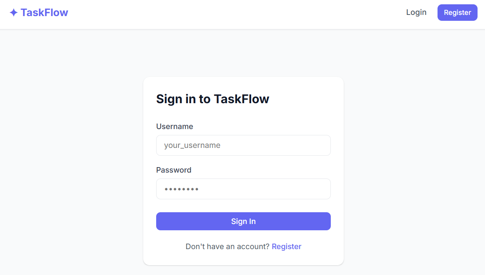
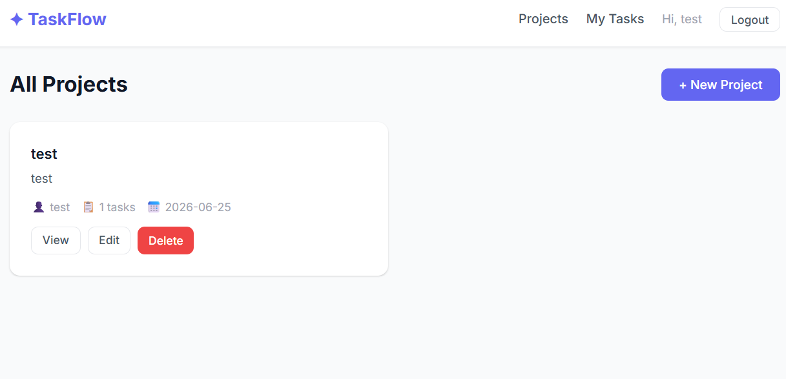
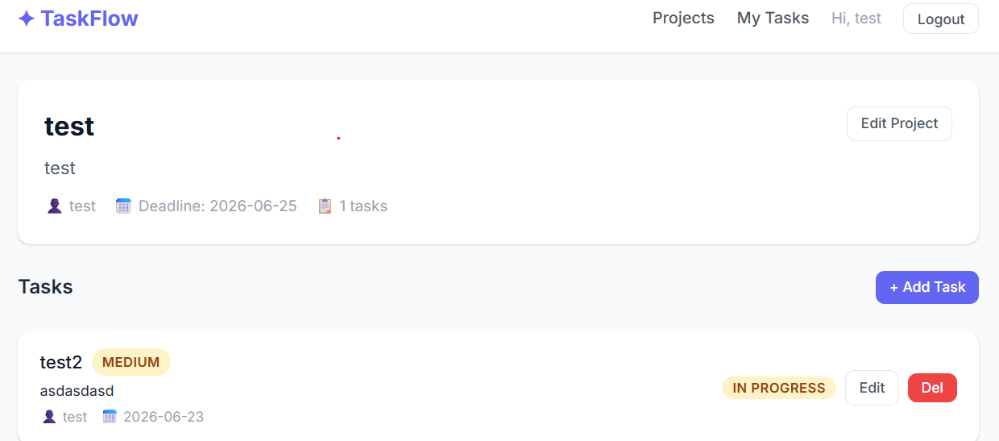

# TaskFlow

A full-stack task and project management application built with Spring Boot and React.

## Features

- **User authentication** — register, login, and session-based auth
- **Projects** — create, update, and delete projects you own
- **Tasks** — create tasks inside projects, assign them to users, and track status
- **My Tasks** — view all tasks assigned to you across every project
- **Role-based access** — only project owners can modify or delete their projects

## Tech Stack

| Layer | Technology |
|---|---|
| Backend | Java 17, Spring Boot 3, Spring Security |
| Database | MySQL 8, Spring Data JPA / Hibernate |
| Frontend | React 18, Vite, Axios |
| Auth | HTTP Session (cookie-based) |

## Screenshots

### Login


### Projects


### Project Detail


### My Tasks


## Getting Started

### Prerequisites

- Java 17+
- Node.js 18+
- MySQL 8

### Backend

1. Create the database:
   ```sql
   CREATE DATABASE taskflow_db;
   ```

2. Configure credentials in `backend/src/main/resources/application.properties`:
   ```properties
   spring.datasource.username=root
   spring.datasource.password=yourpassword
   ```

3. Run:
   ```bash
   cd backend
   mvn spring-boot:run
   ```
   The API starts on `http://localhost:8080`.

### Frontend

```bash
cd frontend
npm install
npm run dev
```

The app opens at `http://localhost:5173`.

## API Overview

| Method | Endpoint | Auth | Description |
|---|---|---|---|
| POST | `/api/auth/register` | — | Register a new user |
| POST | `/api/auth/login` | — | Login and start session |
| POST | `/api/auth/logout` | ✓ | End session |
| GET | `/api/auth/me` | ✓ | Current user info |
| GET | `/api/projects` | — | List all projects |
| POST | `/api/projects` | ✓ | Create a project |
| PUT | `/api/projects/{id}` | ✓ | Update a project |
| DELETE | `/api/projects/{id}` | ✓ | Delete a project |
| GET | `/api/tasks/my` | ✓ | Tasks assigned to me |
| POST | `/api/projects/{id}/tasks` | ✓ | Create a task |
| PATCH | `/api/tasks/{id}/status` | ✓ | Change task status |
| PATCH | `/api/tasks/{id}/assign` | ✓ | Assign task to a user |

## Project Structure

```
taskflow/
├── backend/
│   └── src/main/java/bg/vasil/taskflow/
│       ├── config/          # Security, CORS, session filter
│       ├── controller/      # REST controllers
│       ├── dto/             # Request / response DTOs
│       ├── entity/          # JPA entities
│       ├── exception/       # Global exception handler
│       ├── repository/      # Spring Data repositories
│       └── service/         # Business logic
└── frontend/
    └── src/
        ├── api/             # Axios client
        ├── context/         # Auth context
        ├── components/      # Shared components
        └── pages/           # Route pages
```
